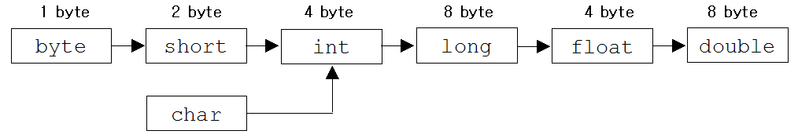

<style>
    .slide {
        font-family: 'Noto Sans CJK KR'
    }

    pre {
        font-size: 75%;
    }
</style>

# 자바: 더 블랭크
## 1. 기본

---

### 변수

#### 블랭크 1

____에 들어갈 말은?

```java
package theblank.blank1;

public class Blank11 {

	public static void main(String[] args) {
		____ test = 1000000000000000L;
		System.out.println(test);
	}
}
```

---

#### 블랭크 2

```java
package theblank.blank1;

public class Blank12 {

	public static void main(String[] args) {
		int test = Integer.MAX_VALUE;
		System.out.println(test+1);
	}
}

// 출력 결과: ____
```

---

##### 필 1, 2

- 쉽게 말하면 변수는 값을 저장할 수 있는 메모리 공간
- 변수 타입은 메모리에 값을 저장하는 방법을 나타냄
- 범위에 따라 저장할 수 있는 값의 범위가 정해져있음

|        | 1byte   | 2byte | 4byte   | 8byte      |
|:------:|:-------:|:-----:|:-------:|:----------:|
| 논리형 | boolean |       |         |            |
| 문자형 |         | char  |         |            |
| 정수형 | byte    | short | **int** | long       |
| 실수형 |         |       | float   | **double** |

---

#### 블랭크 3

```java
package theblank.blank1;

public class Blank13 {

	public static void main(String[] args) {
		short a = 66;
		char b = ____ + 1;
		
		System.out.printf("%d\n", a);
		System.out.printf("%d\n", (int)b);
		System.out.println(a == b);
	}
}

// 출력 결과: 66 66 true
```

---

#### 필 3

- 변수 타입은 메모리로부터 값을 읽어오는 방법을 나타내는 것이기도 함.
- 형변환 방법: (타입)피연산자
- 자동 형변환: 컴파일러는 연산 과정에서 다른 타입을 자동으로 일치시키려고 시도한다.
    - 기준: 기존의 값을 최대한 보존할 수 있는 타입으로 형변환
	

---

### 흐름제어

#### 블랭크 4

- 80 이상: A, 60 이상 80 미만: B, 40 이상 60 미만: C, 40 미만: F

```java
package theblank.blank1;

import java.util.List;

public class Blank14 {

	public static void main(String[] args) {
		List<ExamResult> list = new ExamStub().getResult();
		
		System.out.println(list.get(0).getExamAbout() + "의 절대 등급 계산 결과");
		
		___ (____) {
			____
			// 점수 얻기: result.getScore();
			System.out.println(result.getExamName() + ": " + grade);
		}
	}
}

// 출력 결과: 2022학년도 2학기 기말고사의 절대 등급 계산 결과
// 국어: A 등급 영어: C 등급 수학: F 등급
```

<style scoped>
	li {
		font-size: 18px;
	}
	pre {
		font-size: 50%;
	}
</style>

---

### 다른 블랭크가 있나요?

